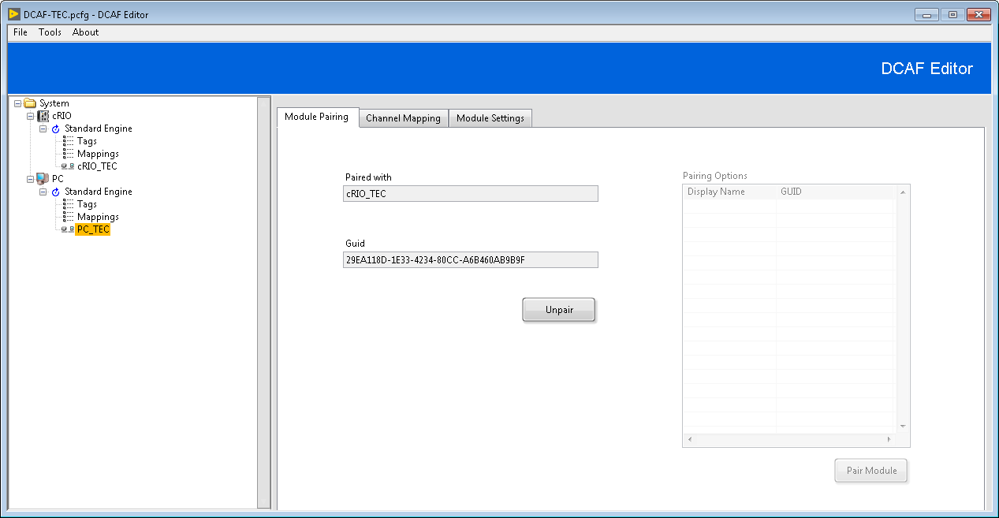
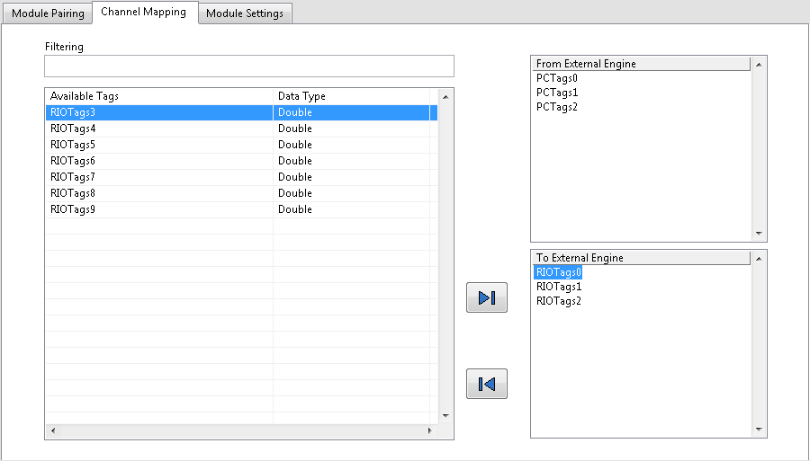
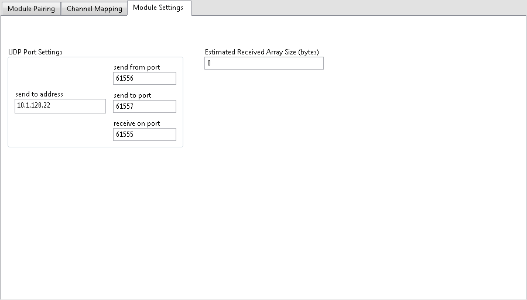

# Overview

The TagBus Engine Communication (TEC) Module allows DCAF applications to share data between engines using [UDP](http://www.ni.com/tutorial/4950/en/). This allows DCAF engines to share data both locally and across a network while minimizing coupling and code dependencies.

# Configuration of the TEC Module

### Module Pairing

**Pairing Options:** List of all other TEC Modules in the current configuration which are both unpaired, and do not reside in the same engine.

**Pair Module:** Pair active module with module selected in **Pairing Options**. Modules must be paired before data can be exchanged to or from the active TEC module.

Only after pairing modules will available tags be populated in the **Channel Mapping** tab.

**Paired With:** The alias of the TEC module paired to the active module.

**GUID:** Unique ID of the TEC module paired to the active module.

**Unpair:** Disconnects the active module from the paired TEC module.

>**Note:** After unpairing a the TEC module, all tags from the external engine will be deleted causing any channel previously connected to this tag to become disconnected.

### Channel Mapping

**Filtering:** Filter list of available tags using the syntax of the [Match Pattern](http://zone.ni.com/reference/en-XX/help/371361R-01/glang/match_pattern/) primitive.

**Available Tags:** List of all available tags which can be transferred to the paired module.

**To External Engine:** List of all tags to be transferred to the paired module.

By selecting tags in the **Available Tags** list and pressing the right arrow, the tags can be moved into the **To External Engine*** list. Conversely, by selecting tags in the **To External Engine** list and pressing the left arrow, tags can be moved back into the **Available Tags** list.

**From External Engine:** List of all tags which will be read from the paired module. Tags of the same name and appropriate data type will be created in the current engine if they do not exist already.

### Module Settings

**Send to Address:** IP address of the paired module.

**Send From Port:** UDP port which data will be sent from.

**Send To Port:** UDP port which data will be sent to. This should match the value of **Receive on Port** of the paired module.

**Receive On Port:** UDP port which data will be read from. This should match the value of **Send To Port** of the paired module.

>**Note:** When updating the value of **Send to Port** or **Receive on Port** of one module, the paired module will automatically update these values to remain complementary.

**Estimated Received Array Size (bytes):** An optional field which helps the module more quickly reach an appropriate read size (since UDP reads must determine a buffer size up front).

While all scalar values may be accounted for, variable sized items like arrays cannot. This field allows the user to provide a "guess" for how large their arrays will be and thus will help the UDP module determine the actual size more quickly.

# Classified Errors

The following errors are handled by the TEC Module's classify error function.

Error Number | Description | Classification
---|---|---
20 | Configuration token not found. Data received is from a TEC module but key does not paired module's key. | Critical
113 |  A message sent on a datagram socket was larger than the internal message buffer or some other network limit, or the buffer used to receive a datagram was smaller than the datagram itself. | Trivial

# Software Requirements

+ LabVIEW 2014 or later
